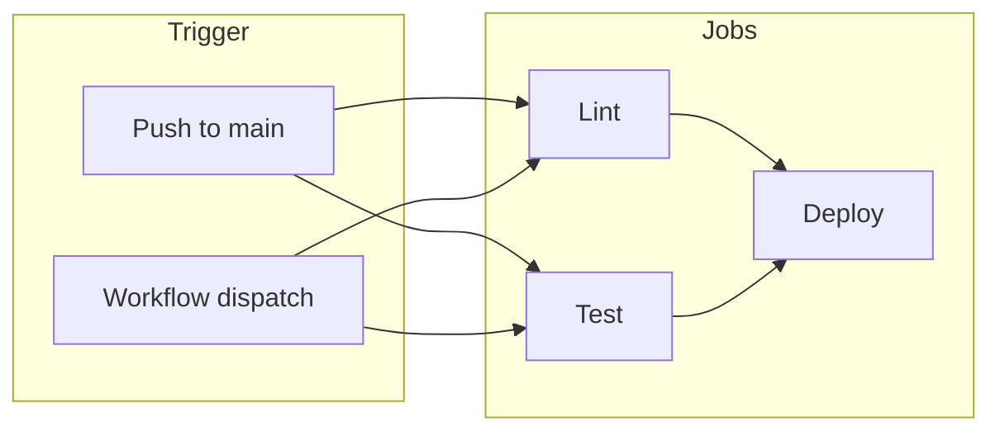
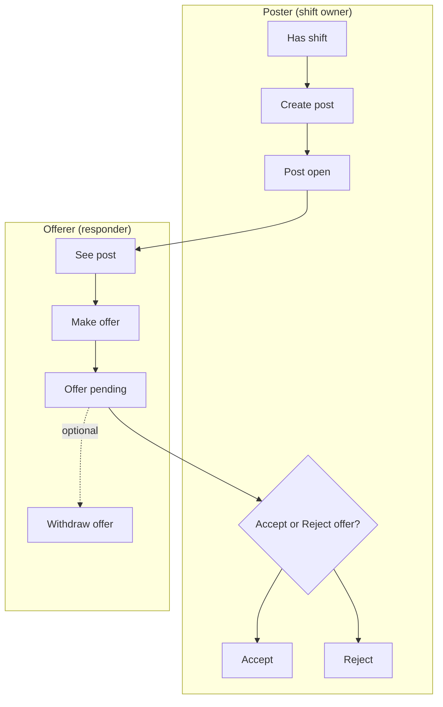
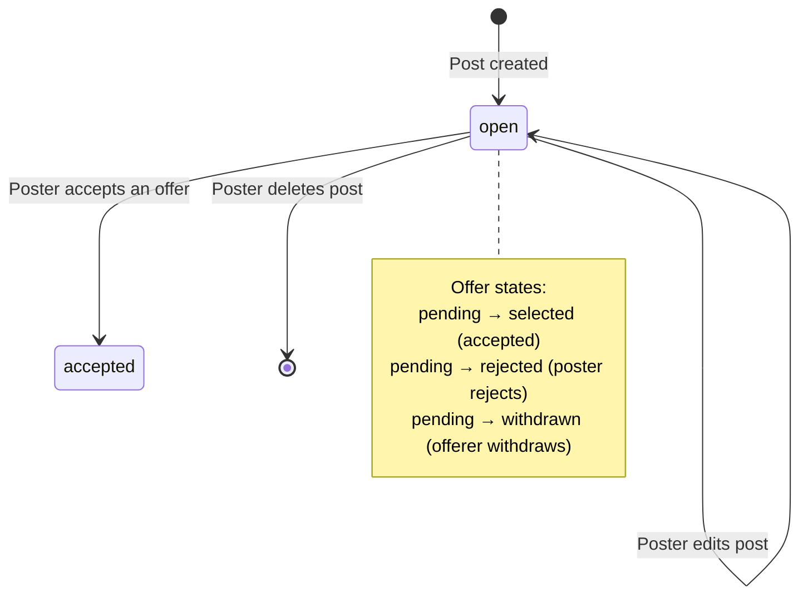
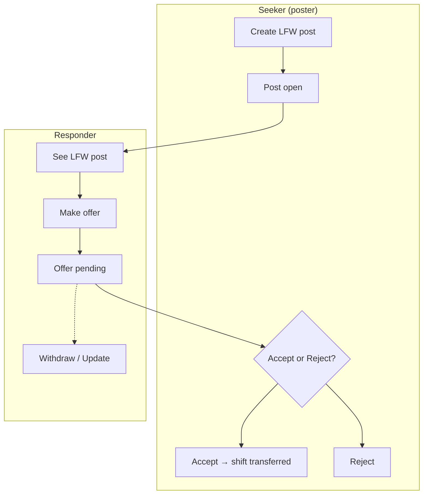
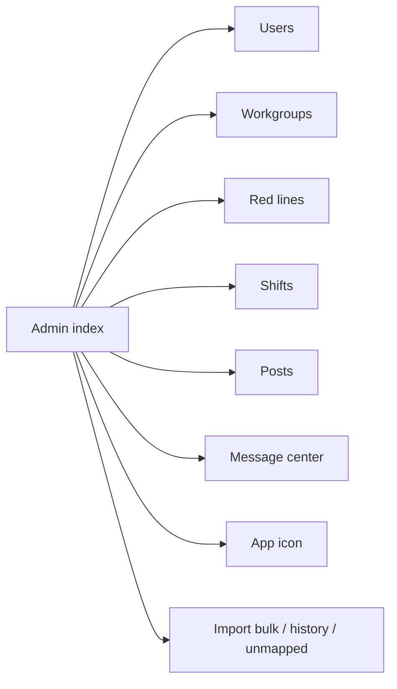
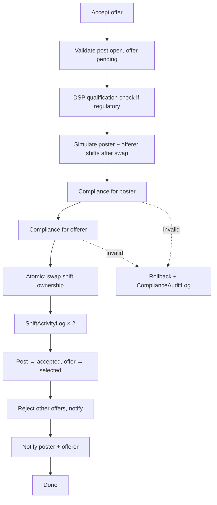

# Donkey Swap V2 — Workflow visualizations

This document describes the main workflows in the codebase, with Mermaid diagrams you can view in GitHub, VS Code (with a Mermaid extension), or [mermaid.live](https://mermaid.live).

---

## 1. CI/CD (GitHub Actions)

### Deploy workflow (`deploy.yml`)

Runs on **push to `main`** or **manual "Run workflow"**. Lint and Test run in parallel; Deploy runs only if both pass.



**Steps:**

| Job   | Steps |
|-------|--------|
| **Lint** | Checkout → Setup PHP 8.4 + Node 22 → `composer install`, `npm ci` → `composer lint` (Pint) → `npm run format` → `npm run lint` |
| **Test** | Checkout → Setup PHP + Node → Install deps → Copy `.env`, key generate → `npm run build` → `./vendor/bin/pest` |
| **Deploy** | Verify secrets → Checkout → Composer (no-dev) → Prepare .env → `npm ci && npm run build` → **Upload `public/build/` via FTP** → **SSH: git pull, composer, migrate, config/route cache** |

### Other workflows

- **`lint.yml`** (linter): On push/PR to develop/main/master/workos → Run Pint + frontend format + frontend lint.
- **`tests.yml`** (tests): On push/PR to same branches → Install deps, build, run Pest.

---

## 2. Shift swap / post workflow (core app)

User **posts** a shift (trade, cash, flight_follow, or time_trade). Others **offer**. Poster **accepts** or **rejects**; offerer can **withdraw**. Accept path differs by post type.

### High-level flow



### Post types and accept behavior

| Type           | Accept action |
|----------------|----------------|
| **trade** / **time_trade** | `SwapTransactionService::executeTrade()` — swap poster’s shift and offerer’s shift (with compliance + DSP checks). |
| **cash** / **flight_follow** | Transfer shift to offerer; close post; mark offer selected; reject other offers; notify. |

### Swap post state flow



### API endpoints (swap)

| Action | Method | Endpoint |
|--------|--------|----------|
| Create/update posts for a shift | POST | `api/shifts/{shift}/postings` |
| Bulk postings | POST | `api/postings/bulk` |
| Delete post | DELETE | `api/posts/{post}` |
| Make offer | POST | `api/posts/{post}/offer` |
| Accept offer | POST | `api/offers/{offer}/accept` |
| Reject offer | POST | `api/offers/{offer}/reject` |
| Withdraw offer | POST | `api/offers/{offer}/withdraw` |

---

## 3. Looking for work (LFW) workflow

User **seeks work** on a date (with optional desk types, cash, etc.). Others **offer** one of their shifts. Poster **accepts** or **rejects**; offerer can **withdraw** or **update** offer.



**API:**  
`POST api/looking-for-work/posts`, `POST .../posts/{id}/offers`, `POST .../offers/{id}/accept`, `reject`, `withdraw`, `PUT .../offers/{id}` (update).

---

## 4. Schedule import workflow (user)

User uploads ARIS-style CSV. **Preview** shows what would be created/updated and any unmapped desk codes. **Apply** creates/updates shifts and records a run.

```mermaid
flowchart LR
    subgraph input["Input"]
        CSV[CSV file or csv_content]
    end

    subgraph checks["Checks"]
        SIZE[Size ≤ 10MB]
        EMP[User has employee_id]
        ROWS[Rows for employee_id]
    end

    subgraph preview["Preview"]
        PARSE[Parse CSV]
        FILTER[Filter leave rows]
        MY[Filter by employee_id]
        RESOLVE[Resolve desk codes]
        UNMAPPED[Record unmapped]
        PREV[Return preview + unmapped]
    end

    subgraph apply["Apply"]
        SAME[Same parse/filter/my]
        APPLY[applyForUser]
        RUN[Create ScheduleImportRun]
        SHIFTS[Create/update shifts]
    end

    CSV --> SIZE
    SIZE --> EMP
    EMP --> ROWS
    ROWS --> PARSE --> FILTER --> MY --> RESOLVE --> UNMAPPED --> PREV
    PREV -.->|user confirms| SAME --> APPLY --> RUN
    APPLY --> SHIFTS
```



**API:**  
- `POST api/schedule-import/preview` — returns `preview`, `unmapped`, `errors`.  
- `POST api/schedule-import/apply` — returns `run_id`, `created`, `updated`, `skipped`, `conflict`, etc.

**Admin** has bulk import and history: `schedule-import/bulk-preview`, `bulk-apply`, `import-history`, `import-unmapped-codes`.

---

## 5. App and settings (page-level)

```mermaid
flowchart TB
    LANDING[/]
    AUTH[Auth: login, register, verify]
    APP[/app]
    DASH[Dashboard]
    AV[Available]
    LFW[Looking for work]
    NOTIF[Notifications]
    SETTINGS[Settings]
    PROFILE[Profile]
    PASS[Password]
    PREF[Preferences]
    QUAL[Qualifications]
    TWOFA[Two-factor]
    IMPORT[Import schedule]

    LANDING --> AUTH
    AUTH --> APP
    APP --> DASH
    APP --> AV
    APP --> LFW
    APP --> NOTIF
    APP --> SETTINGS
    SETTINGS --> PROFILE
    SETTINGS --> PASS
    SETTINGS --> PREF
    SETTINGS --> QUAL
    SETTINGS --> TWOFA
    SETTINGS --> IMPORT
```

---

## 6. Admin (high-level)

All under `/app/admin` with `admin` middleware.



---

## 7. Trade execution detail (trade / time_trade accept)

When the poster **accepts** a **trade** or **time_trade** offer, `SwapTransactionService::executeTrade()` runs:



---

## Summary

| Workflow           | Trigger / entry              | Main outcome |
|--------------------|-----------------------------|--------------|
| **CI/CD Deploy**   | Push to main / manual        | Lint + test → build → FTP assets → SSH deploy |
| **Swap post**     | User posts shift → offer → accept/reject | Trade: swap shifts. Cash/flight_follow: transfer shift. |
| **Looking for work** | User posts LFW → offer → accept/reject | Shift transferred to seeker. |
| **Schedule import** | User uploads CSV → preview → apply | Shifts created/updated; run + unmapped recorded. |
| **App/Settings**   | Navigation                  | Dashboard, Available, LFW, Notifications, Settings (profile, password, prefs, quals, 2FA, import). |
| **Admin**          | Admin user → /app/admin     | Users, workgroups, red lines, shifts, posts, message center, app icon, schedule import. |

If you want more detail on a specific flow (e.g. compliance rules, notification types, or bulk import), say which one and we can extend this doc or add another diagram.

---

## 8. Compliance rules (how they are set)

Compliance is enforced by **`App\Services\ComplianceValidator`**. It checks that a set of shifts (and optional flight-follow segments) for a user would not violate work rules. The **parameters** that drive the rules come from:

### Where compliance parameters come from

| Parameter | Source | Default if not set |
|-----------|--------|---------------------|
| **max_hours_per_day** | Workgroup (`workgroups.max_hours_per_day`) | 10 |
| **rest_required_hours** | Workgroup (`workgroups.rest_required_hours`) | 8 (also `ComplianceValidator::REST_HOURS`) |
| **allow_double** | Workgroup (`workgroups.allow_double`) | false |
| **regulatory** | Workgroup (`workgroups.regulatory`) | true (strict) |

So **compliance rules are set per workgroup** in the **Workgroup** model (admin-managed). The `workgroups` table has:

- `regulatory` (boolean)
- `max_hours_per_day` (int, default 10)
- `rest_required_hours` (int, default 8)
- `allow_double` (boolean, default false)

When validating (e.g. before a trade or when checking “can take giveaway”), the shift’s workgroup is used to load these values; `SwapTransactionService` and `PostEligibilityService` pass them into `ComplianceValidator::validateForUser()`.

### The five compliance checks (in code order)

1. **No overlap (with regulatory vs non-regulatory)**  
   - **Regulatory:** Any overlap between two shifts (or segments) is invalid.  
   - **Non-regulatory:** Overlap is allowed only up to **30 minutes** (`ComplianceValidator::MAX_OVERLAP_NON_REGULATORY_MINUTES`).

2. **Per-day hours**  
   - **Regulatory:** Total duty that day must be ≤ `max_hours_per_day`.  
   - **Non-regulatory:** If `allow_double` is false, same limit; if true, over 10 hours is allowed (doubles).

3. **Rest before** (only when workgroup is regulatory or any block is regulatory)  
   - Between the end of one block and the start of the next there must be at least **rest_required_hours** (default 8).

4. **Rest after** (same condition)  
   - For each block, no other shift may start before **rest_required_hours** after that block’s end (no shift in the “rest window”).

5. **Midnight crossing**  
   - Rest window is one continuous block (handled in UTC); no extra rule text.

Violations are recorded in **`compliance_audit_logs`** with `action_type` e.g. `compliance_validation_failed`, `trade_compliance_failed`, `trade_qualification_failed`.

---

## 9. Eligibility rules (how they are set)

Eligibility answers: “Can this user work this shift?” and “Can this user take this post (giveaway / flight follow / time trade)?”. It is implemented in **`App\Services\PostEligibilityService`** and used by **`App\Http\Controllers\App\AvailableController`** (Available page, dashboard counts, dates-with-eligible-giveaway).

### 9.1 Qualification to work a shift (`userCanWorkShift`)

- **Desk type / qualification:**  
  - If the shift has a **desk_type**, the service looks up **`WorkgroupDeskType`** for that workgroup + code.  
  - If the desk type has a **`workgroup_qualification_id`**, the user must have that qualification (via **user_workgroup_qualifications** / workgroup qualifications) to be “eligible to work” the shift.  
  - If there is no `WorkgroupDeskType` row, a **legacy map** is used: `intl` → INTL, `etops` → ETOPS, `assistant_desk` → ASST, `domestic_dispatch` → DSP; then the user must have that qualification code for the workgroup.  
  - If no qualification is required (null in DB or no mapping), the user is allowed.

So **eligibility to work a shift** is set by:

- **Admin:** Workgroup → Desk types (`WorkgroupDeskType`: code, optional `workgroup_qualification_id`).  
- **Admin:** User qualifications per workgroup (e.g. DSP, INTL).  
- **Legacy:** Desk type code → qualification code map in `PostEligibilityService::DESK_TYPE_TO_QUALIFICATION_CODE` when the workgroup has no desk type row.

### 9.2 Eligible to take a **giveaway (cash)** post (`canTakeGiveaway`)

- User must be able to **work the shift** (desk type / qualification as above).  
- **Compliance:** Adding that shift to the user’s existing shifts must pass **ComplianceValidator** (overlap, daily hours, rest), using the shift’s workgroup settings (max hours, rest, allow_double, regulatory).

So eligibility for cash posts = **qualification (desk type)** + **compliance (workgroup rules)**.

### 9.3 Eligible to take a **flight_follow** post (`canTakeFlightFollow`)

- User must have **DSP** qualification in that workgroup.  
- **Compliance:** Adding a **segment** (shift start + `flight_follow_minutes`) to the user’s shifts must pass **ComplianceValidator** (same workgroup params). Segments are always treated as regulatory.

So eligibility for flight follow = **DSP qualification** + **compliance**.

### 9.4 Eligible to take a **time_trade** post

- Not in `PostEligibilityService`; computed in **AvailableController**: user must have **at least one shift on the same calendar date** as the post’s shift (so they have something to offer in return).  
- No compliance check in the “eligible” count; compliance is enforced when the offer is accepted (trade execution).

### 9.5 Trade posts

- **Eligibility** on the Available page: user must be able to work the shift (`userCanWorkShift`); trade-specific rules (e.g. “same start time = hide”) are applied in the controller.  
- **Compliance** for the actual swap is enforced in **`SwapTransactionService::executeTrade()`** (both poster and offerer’s resulting schedules are validated).

### 9.6 Red lines

- **`ClassificationRedLine`** (per workgroup: `red_line_position`) and the user’s **`red_line_seniority_number`** on **user_workgroups** are used for **seniority/position** (e.g. who can hold which positions). They are **not** used inside `ComplianceValidator` or the core eligibility checks above; they support other business logic (e.g. who can be assigned to which roles).

---

### Summary

| What | Where it’s set | Used for |
|------|-----------------|----------|
| **Compliance rules** | Workgroup: `regulatory`, `max_hours_per_day`, `rest_required_hours`, `allow_double` | Trade execution, giveaway/flight-follow eligibility |
| **Rest / overlap constants** | `ComplianceValidator`: `REST_HOURS` (8), `MAX_OVERLAP_NON_REGULATORY_MINUTES` (30) | All compliance checks |
| **Qualification required for a desk type** | `WorkgroupDeskType.workgroup_qualification_id` (admin) | “Can user work this shift?” |
| **User qualifications** | User’s workgroup qualifications (admin) | Shift eligibility, DSP for flight follow / regulatory trade |
| **Time-trade “eligible”** | Same-date shift check in AvailableController | Showing eligible time_trade posts |
| **Red lines** | ClassificationRedLine + user pivot `red_line_seniority_number` | Seniority/position logic, not compliance/eligibility in Validator or PostEligibilityService |
